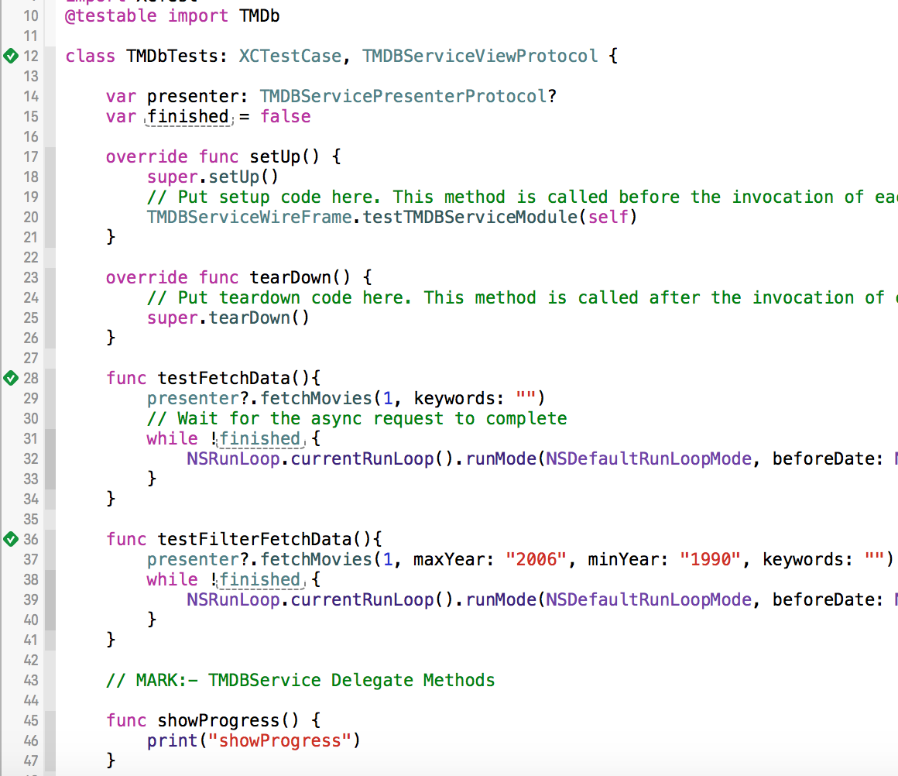

TMDB Client APP
===========

A simple iOS app using Swift 2.3 that displays movies from TMDb. Written BY : <a href ="http://goo.gl/eaohSg">Faris Abu Saleem</a>.

<h2>
<a id="user-content-features" class="anchor" href="#features" aria-hidden="true">
</a>Features
</h2>

<ul class="task-list">
<li>Written in a clean architecture</li>
<li>Code resuable</li>
<li>Multi-Tier layer</li>
<li>Unit testing enabled for TMDB module</li>
<li>View & Filter movies by release date</li>
</ul>

<h2>
<a id="user-content-features" class="anchor" href="#features" aria-hidden="true">
</a>Screenshot
</h2>

     
     

  

    

<h1>Unit Testing Result</h1>

    

<h1>License</h1>

TMDB is released under an <a href="http://opensource.org/licenses/MIT">MIT License</a>. See LICENSE for details.

Copyright © 2017, Faris Abu Saleem. All rights reserved.

